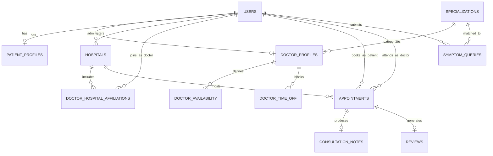

# DESIGN.md — Healthcare Platform

## 1. Overview

Three portals sharing one backend and one database:
- **Patient Portal** — discovery, AI symptom search, booking, history
- **Doctor Portal** — dashboard, availability, consultations
- **Hospital Admin Portal** — onboarding, oversight, analytics

Users authenticate via one Supabase Auth instance, but the frontend and
backend enforce **separate login entry points per role** (`/login/patient`,
`/login/doctor`, `/login/admin`), each verified server-side against the
matching profile table.

## 2. Database Schema

```sql
-- Core identity (mirrors Supabase auth.users via id)
users (
  id UUID PRIMARY KEY,
  role TEXT CHECK (role IN ('patient','doctor','hospital_admin')),
  full_name TEXT,
  phone TEXT,
  email TEXT,
  created_at TIMESTAMPTZ DEFAULT now()
)

-- Hospitals
hospitals (
  id UUID PRIMARY KEY DEFAULT gen_random_uuid(),
  name TEXT NOT NULL,
  address TEXT,
  latitude DOUBLE PRECISION,
  longitude DOUBLE PRECISION,
  departments TEXT[],
  timings JSONB,                 -- e.g. { "mon": "9-17", ... }
  admin_id UUID REFERENCES users(id),
  created_at TIMESTAMPTZ DEFAULT now()
)

-- Standardized specialization list (AI maps into this table only)
specializations (
  id SERIAL PRIMARY KEY,
  name TEXT UNIQUE NOT NULL,
  description TEXT
)

-- Doctor profile
doctor_profiles (
  user_id UUID PRIMARY KEY REFERENCES users(id),
  specialization_id INT REFERENCES specializations(id),
  license_no TEXT,
  years_experience INT,
  consultation_fee NUMERIC,
  bio TEXT,
  status TEXT CHECK (status IN ('pending','active','rejected')) DEFAULT 'pending',
  rating_avg NUMERIC DEFAULT 0,
  rating_count INT DEFAULT 0
)

-- Many-to-many: doctors can be affiliated with multiple hospitals
doctor_hospital_affiliations (
  doctor_id UUID REFERENCES users(id),
  hospital_id UUID REFERENCES hospitals(id),
  invited_by UUID REFERENCES users(id),
  status TEXT CHECK (status IN ('invited','accepted','revoked')) DEFAULT 'invited',
  PRIMARY KEY (doctor_id, hospital_id)
)

-- Doctor recurring weekly availability, per hospital
doctor_availability (
  id SERIAL PRIMARY KEY,
  doctor_id UUID REFERENCES users(id),
  hospital_id UUID REFERENCES hospitals(id),
  day_of_week INT,               -- 0=Sun..6=Sat
  start_time TIME,
  end_time TIME,
  slot_duration_minutes INT DEFAULT 15
)

-- One-off time-off / blocked slots (holidays, leave)
doctor_time_off (
  id SERIAL PRIMARY KEY,
  doctor_id UUID REFERENCES users(id),
  start_datetime TIMESTAMPTZ,
  end_datetime TIMESTAMPTZ,
  reason TEXT
)

-- Patient profile
patient_profiles (
  user_id UUID PRIMARY KEY REFERENCES users(id),
  date_of_birth DATE,
  gender TEXT,
  allergies TEXT[],
  chronic_conditions TEXT[]
)

-- Appointments
appointments (
  id UUID PRIMARY KEY DEFAULT gen_random_uuid(),
  patient_id UUID REFERENCES users(id),
  doctor_id UUID REFERENCES users(id),
  hospital_id UUID REFERENCES hospitals(id),
  appointment_time TIMESTAMPTZ NOT NULL,
  status TEXT CHECK (status IN ('booked','completed','cancelled','no_show')) DEFAULT 'booked',
  symptom_query TEXT,
  created_at TIMESTAMPTZ DEFAULT now(),
  UNIQUE (doctor_id, appointment_time)     -- slot-lock constraint
)

-- Consultation notes / prescriptions
consultation_notes (
  id SERIAL PRIMARY KEY,
  appointment_id UUID REFERENCES appointments(id),
  doctor_id UUID REFERENCES users(id),
  notes TEXT,
  prescription TEXT,
  created_at TIMESTAMPTZ DEFAULT now()
)

-- AI symptom search logs
symptom_queries (
  id SERIAL PRIMARY KEY,
  patient_id UUID REFERENCES users(id),
  raw_input TEXT,
  matched_specialization_id INT REFERENCES specializations(id),
  urgency_level TEXT CHECK (urgency_level IN ('routine','same_day','emergency')),
  confidence_score FLOAT,
  created_at TIMESTAMPTZ DEFAULT now()
)

-- Ratings/reviews
reviews (
  id SERIAL PRIMARY KEY,
  appointment_id UUID REFERENCES appointments(id) UNIQUE,
  patient_id UUID REFERENCES users(id),
  doctor_id UUID REFERENCES users(id),
  rating INT CHECK (rating BETWEEN 1 AND 5),
  comment TEXT,
  created_at TIMESTAMPTZ DEFAULT now()
)

-- Notification log (for debugging/audit)
notifications (
  id SERIAL PRIMARY KEY,
  user_id UUID REFERENCES users(id),
  channel TEXT CHECK (channel IN ('sms','email')),
  type TEXT,                      -- 'booking_confirmed','reminder','cancelled', etc.
  payload JSONB,
  sent_at TIMESTAMPTZ DEFAULT now()
)
```

## 3. Entity Relationships (Mermaid)



## 4. Role-Based Login Flow

1. Frontend has three distinct entry routes: `/login/patient`, `/login/doctor`,
   `/login/admin`. Each renders the same base form but posts to a
   role-specific backend endpoint.
2. Backend authenticates via Supabase, then checks the corresponding profile
   table exists for that `user_id` (`doctor_profiles`, `patient_profiles`, or
   `hospitals.admin_id`). If not, reject with a clear "not registered as
   this role" error — do not fall back or auto-create.
3. For doctors: also check `doctor_profiles.status = 'active'`. If `pending`,
   redirect to a "waiting for hospital approval" screen instead of the
   dashboard.
4. On success, issue session and redirect: `patient → /patient/dashboard`,
   `doctor → /doctor/dashboard`, `hospital_admin → /admin/dashboard`.
5. Every portal's routes are wrapped in a route guard checking `users.role`
   client-side (UX) *and* every API call re-checks role server-side
   (security).

## 5. AI Symptom Matching Architecture

**Goal:** map free-text symptom description → one of the fixed
`specializations` rows + an urgency level, never an invented category.

**Flow:**
1. Patient types symptoms in natural language.
2. Backend sends a prompt to Groq that includes:
   - The full list of specialization names (fetched from `specializations`).
   - Instructions to respond ONLY with strict JSON:
     `{ "specialization": string, "urgency": "routine"|"same_day"|"emergency", "confidence": number }`
   - The specialization value MUST be one of the provided list, or `"unclear"`.
3. Backend validates the returned specialization exists in the table before
   using it. If `"unclear"` or invalid, ask a clarifying follow-up instead of
   guessing.
4. If `urgency = "emergency"`, do NOT show a booking flow — show an
   emergency-redirect screen (nearest ER / emergency contact number) instead.
5. Log every query + result to `symptom_queries` for future tuning.
6. Use the matched specialization to query nearby doctors (join
   `doctor_profiles` + `hospitals`, sorted by distance).

**Model choice:** a small/fast Groq model is sufficient — this is
classification, not open-ended generation. Keep temperature low (e.g. 0.2)
for consistency.

## 6. Slot-Locking / Booking Concurrency

- `appointments` has `UNIQUE (doctor_id, appointment_time)`.
- Booking flow: frontend shows available slots (computed by removing already
  booked and time-off slots from `doctor_availability`). On submit, backend
  attempts an `INSERT` inside a transaction.
- If the insert fails due to the unique constraint, return a clear
  "This slot was just booked, please choose another" error and refresh the
  available slots list. Do not use application-level locking (Redis, etc.) —
  unnecessary at this scale.

## 7. Notification Triggers

| Event                     | Channel     | Recipient |
|---------------------------|-------------|-----------|
| Appointment booked        | Email + SMS | Patient   |
| Appointment reminder (T-1hr) | SMS      | Patient   |
| Appointment cancelled     | Email + SMS | Patient & Doctor |
| Doctor invited by hospital| Email       | Doctor    |
| Doctor approved/rejected  | Email       | Doctor    |

## 8. API Route Map (high-level)

```
/api/auth/patient/login|signup
/api/auth/doctor/login|signup
/api/auth/admin/login

/api/hospitals            GET (list/nearby), POST (admin create/edit)
/api/hospitals/:id        GET (profile + doctors)

/api/doctors/:id          GET (profile)
/api/doctors/:id/availability   GET, POST (doctor/admin)
/api/doctors/:id/time-off       POST (doctor)

/api/symptom-search       POST (patient) -> { specialization, urgency, doctors[] }

/api/appointments         POST (book), GET (list by role)
/api/appointments/:id     PATCH (cancel/complete)
/api/appointments/:id/notes   POST (doctor writes notes/prescription)
/api/appointments/:id/review  POST (patient rates)

/api/admin/hospitals/:id/doctors        GET, POST (invite)
/api/admin/hospitals/:id/analytics      GET
```

## 9. Security Notes

- Use Supabase Row Level Security policies as a second layer of defense
  in addition to backend role checks (defense in depth).
- Doctors can only view patient data for patients who have an appointment
  with them — no open patient lookup.
- Hospital admins can only view doctors/appointments tied to their own
  hospital (`admin_id` match), never other hospitals' data.
